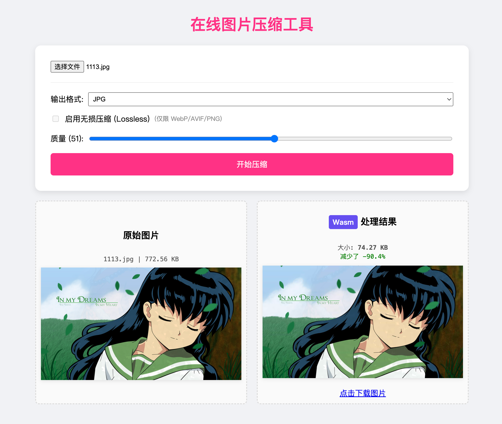

# 浏览器图片压缩与格式转换工具

一个纯浏览器实现的图片处理工具，支持 **图片压缩**、**格式转换**（JPG/PNG/WebP/AVIF 等）、尺寸调整等功能。无需上传服务器，100% 本地处理，保护隐私。

  <!-- 放一张工具运行截图 -->

## 项目简介

本仓库开源了 [改图侠](https://gaituxia.com/) 部分核心功能的实现代码，使用现代浏览器 API（如 Canvas、Web Workers）实现高效图片压缩和格式转换。

如果你需要更完整的在线工具（支持批量处理、证件照压缩、水印、PDF 转图片等），欢迎访问 **[改图侠官网](https://gaituxia.com/)**，无需安装，直接浏览器使用！

关键词：在线图片压缩、图片格式转换、GIF 压缩、WebP 转换、浏览器本地处理

## 主要特性

- 支持多种格式：JPG、PNG、WebP、GIF、AVIF、SVG 等
- 高压缩率：最高 90%，支持自定义压缩质量
- 无损/有损压缩可选
- 批量处理支持
- 纯前端实现，文件不上传服务器

更多高级功能（如 HEIC 转 JPG、RAW 转 JPG、批量加水印）请访问 [改图侠](https://gaituxia.com/) 在线版。
